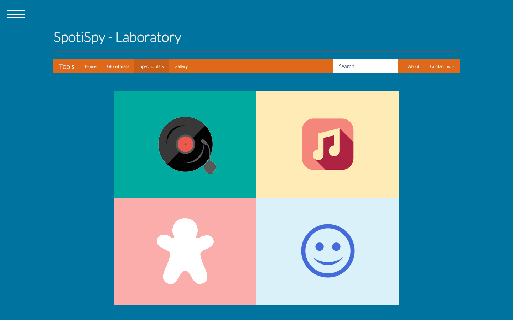
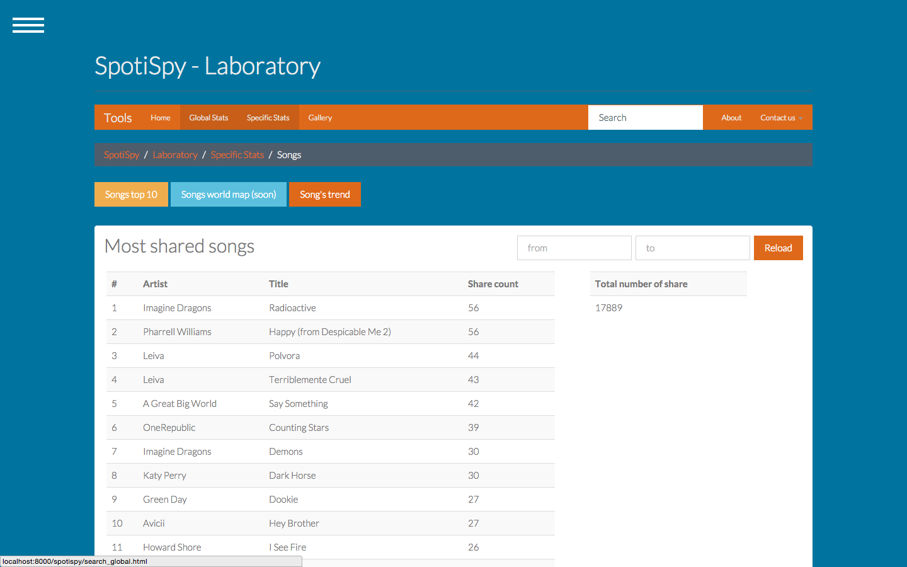
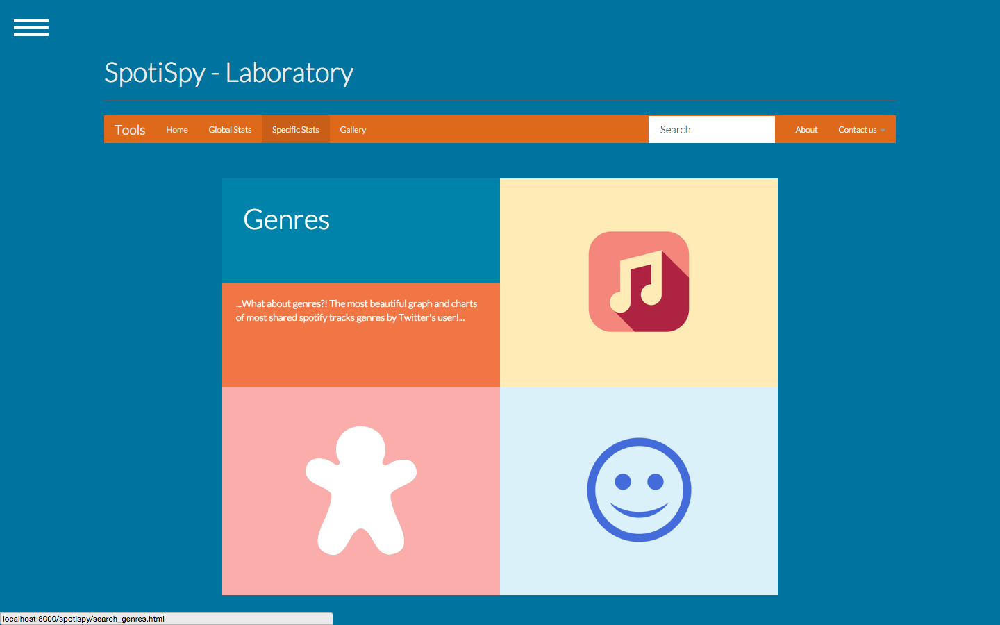
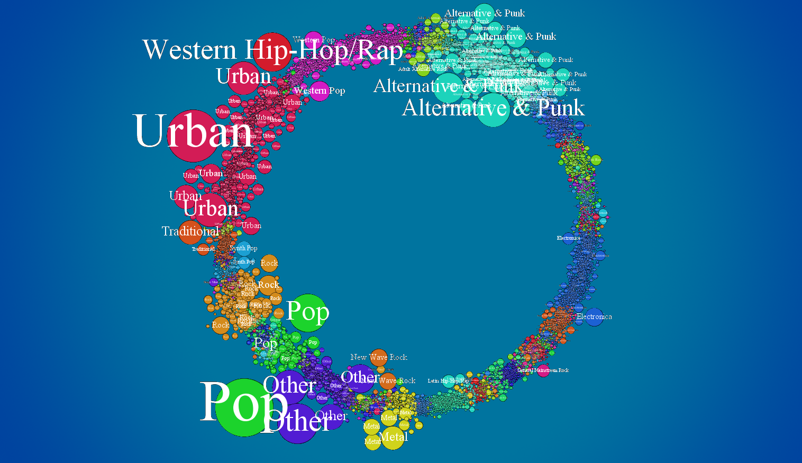
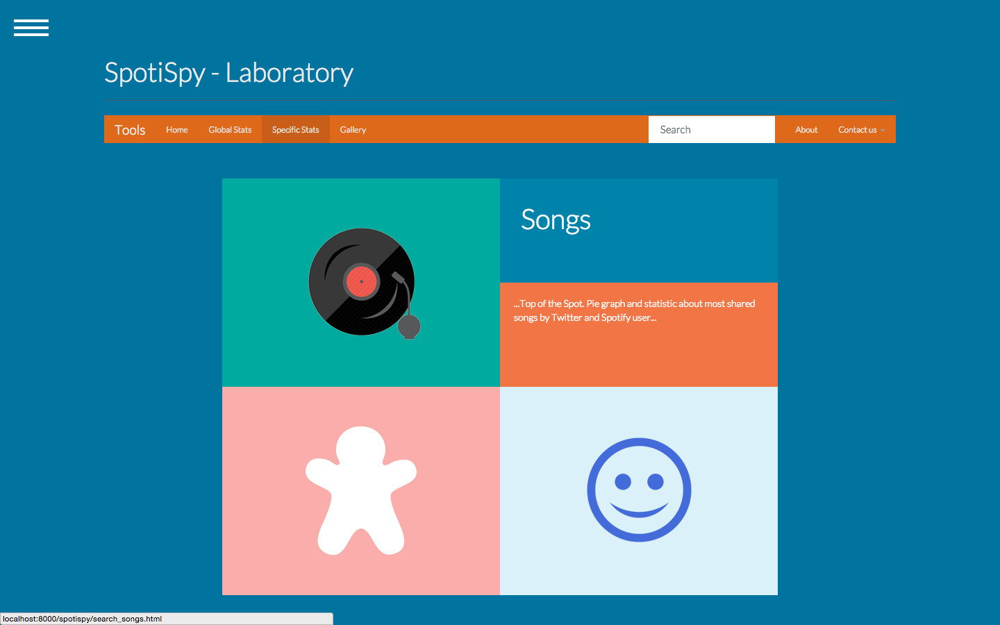
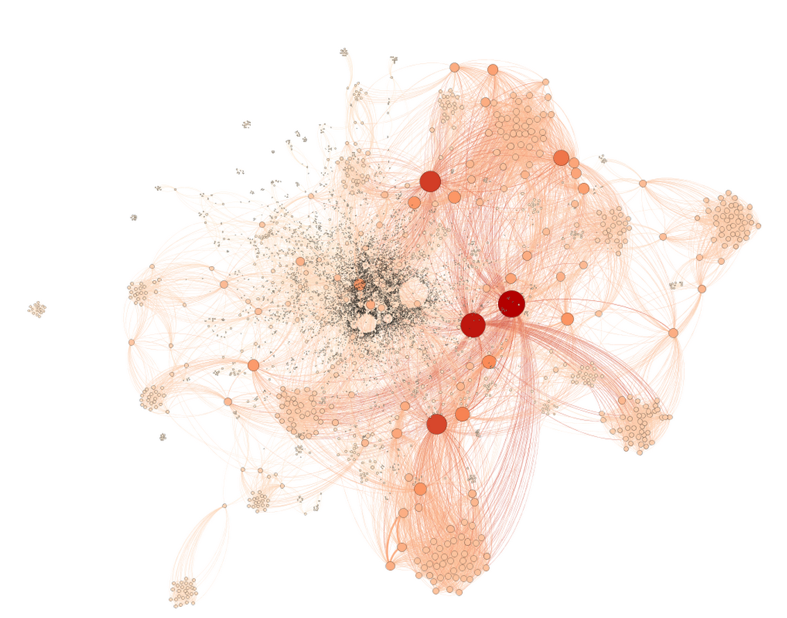
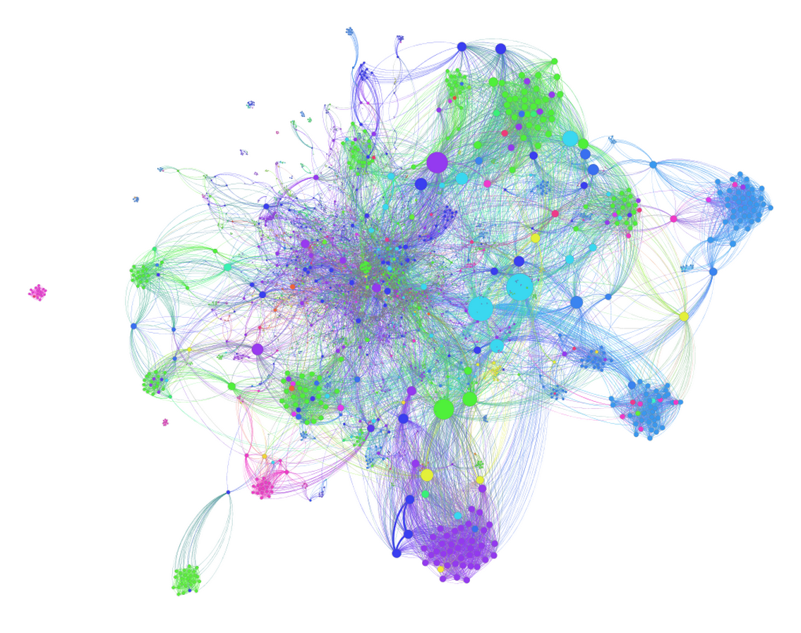
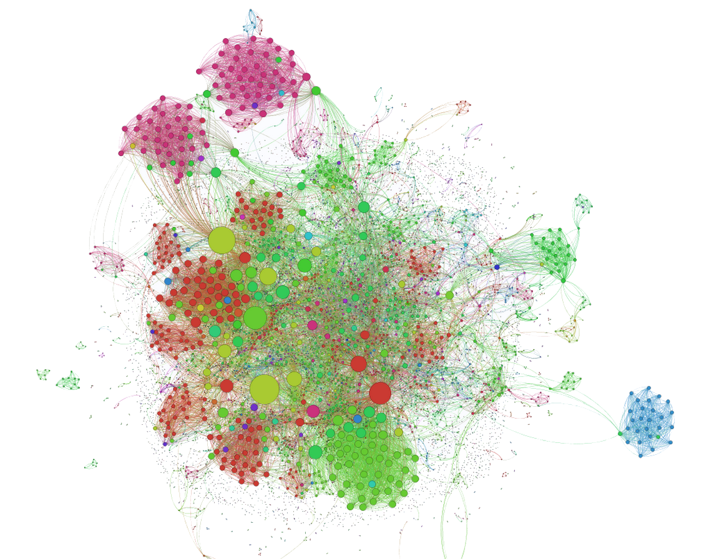

# SpotiSpy

The idea: take the songs heard using Spotify and shared on social to extract information about tracks, genres, users. SpotiSpy performs more than just visualization: it analyzes the kinds of songs, geolocalizes users, extracts the list of most listened songs, and so much more.

For a static demo, click [here](https://made2591.github.com/spotispy-framework)

## Working on docker porting

I'm working with [valentinarho](https://github.com/valentinarho) to port the entire framework to [Docker](https://docker.com) so... stay tuned!.

## Library / Dependencies / API

* [mongo](https://www.mongodb.com)
* [D3js](http://d3js.org/)
* [Gephi](http://gephi.github.io/)
* [JQPlot](http://www.jqplot.com/)
* [jQuery](http://jquery.org/)
* [Last.fm](http://www.lastfm.it/api)
* [Twitter](https://dev.twitter.com/)
* [Google Maps API](https://developers.google.com/maps/)
* [Gracenote API](https://developer.gracenote.com/web-api)
* [R language](http://www.r-project.org)
* [Python](https://www.python.org)
* [Raspberry PI](http://www.raspberrypi.org/)

Project Structure
-------------------

* static-demo: inside ```docs```

## Quick description

The idea: take the songs heard using <a href="http://wwww.spotify.com">Spotify</a> and shared on social to extract information about tracks, genres, users. SpotiSpy performs more than just visualization: it analyzes the kinds of songs, geolocalizes users, extracts the list of most listened songs, and so much more.

##### Specific stats


##### Song sharing chart


##### Genres specific stats


##### Most influential genres


##### Songs specific stats


Through sharing you can find out how much a song is heard: this information is related on set of users that usually share what they are listening to, and this is a limit. But it is a real fact based on the actual interest, and this is a big advantage. Also from the genres of the songs, you can discover about music and users from different country around the world.

By using different databases (crossing data from several sources such as [Gracenote](http://www.gracenote.com/) and [Last.fm](http://www.lastfm.com/)), we tagged and completed the profiles of each song shared in the network for fifteen days. It has come out that music genres are distinctive: in the future, it would be nice to explore how these genre preferences evolve in time.

People who love pop music, listen to pop music. Follow the trend of pop music. Share pop music tracks. And is socially related to those who love pop music. SpotiSpy framework, through use of libraries such as [Networkx](https://networkx.github.io/) and complex network management software such as [Gephi](http://gephi.github.io/), finds these relationships, explores and represents them in suggestive images that allow you to understand the social network topology. In addition, it performs sentiment analysis on the songs, based on the index of the positivity of the genres belonging to them.

##### Sharing Influence


##### Genres Comunities


##### Followers Network


## Next steps

We would like to continue our work by getting more resources and automating all the processes we have done to create a complete free-available tool. For instance, it would be great to take advantage of localization information, isolate them wherever possible, to normalize them and represent the world map to identify where most shared songs come from: this would be usefull to find out whether the same country prefers a song rather than a genre or other, to tie songs to certain events, to analyze the feelings that different country are experiencing on a geographic basis and justify them through the political events of that nation (just think of the riots in Ukraine, or the protests in Russia during the Olympic Games).
